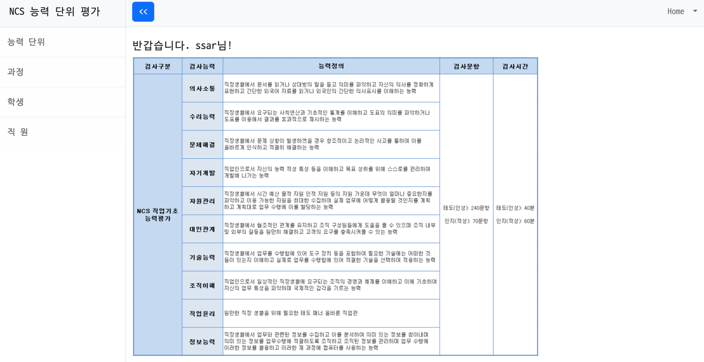

# NCS 기반 평가 프로그램




## 📚 기술 스택

### Backend

  


### Frontend
   


### 협업 도구
   

### 데이터베이스
- 개발 : 
- 배포 : 

### 의존성
```java
dependencies {
    implementation 'org.springframework.boot:spring-boot-starter-data-jpa'
    implementation 'org.springframework.boot:spring-boot-starter-security'
    implementation 'org.springframework.boot:spring-boot-starter-thymeleaf'
    implementation 'org.springframework.boot:spring-boot-starter-web'
    implementation 'org.thymeleaf.extras:thymeleaf-extras-springsecurity6'
    compileOnly 'org.projectlombok:lombok'
    runtimeOnly 'com.h2database:h2'
    runtimeOnly 'org.mariadb.jdbc:mariadb-java-client'
    annotationProcessor 'org.projectlombok:lombok'
    testImplementation 'org.springframework.boot:spring-boot-starter-test'
    testImplementation 'org.springframework.security:spring-security-test'

    // JWT
    implementation group: 'com.auth0', name: 'java-jwt', version: '4.3.0'

    // 유효성 체크 기능 제공
    implementation 'org.springframework.boot:spring-boot-starter-validation'

    // 스프링 시큐리티 테스트 편의성 제공
    testImplementation 'org.springframework.security:spring-security-test'
}
```
## DB 연관 관계 및 자료
https://sudsy-bookcase-2c1.notion.site/NCS-e12669b3cb63469f95bcbc2a0a15e81e


    
# 기능 설명
http://sudsy-bookcase-2c1.notion.site/22f165768fde413b8141d0d4aebfbed6?pvs=74
## 1단계 기능
- 회원가입
- 로그인
- 능력단위 CRUD
- 능력단위 목록/상세보기
- 과정 CRUD
- 과정 목록/상세보기
- 평가지 CRUD
- 평가지 목록/상세보기
- 평가 CRUD
- 평가 목록/상세보기
- 채점지 상세보기

## 2단계 기능
- 스프링 시큐리티
- JWT 적용
- 패스워드 해싱처리

## 보완점
- 아이디 저장 (X)
- 자동 로그인 (X)

# 느낀점
### 컨텍스트의 중요성

프로그래밍에서 컨텍스트의 중요성에 대해 많이 들었지만 실제로 크게 체감하지 못했습니다. 그러나 프론트엔드에서 상태 관리와 데이터 전달을 경험하면서, 다음 페이지로 데이터를 넘길 때 컨텍스트의 유무가 얼마나 큰 차이를 만드는지 깨닫게 되었습니다. 이를 통해 각 페이지가 독립적으로 동작하면서도 필요한 데이터를 공유할 수 있게 되어 작업이 훨씬 효율적이고 직관적으로 변했습니다.

### 하위 요소가 많은 엔티티

먼저 테이블을 보고 엔티티 클래스를 생성한 후 각 기능의 API를 구현했습니다. 기능 자체는 CRUD를 구현하는 것들이었는데, 엔티티가 여러 하위 요소(능력 단위와 단위 정의 내부의 능력 단위 요소 등)를 보유하고 있어서 이를 고려하지 않고 CRUD 기능을 제작했을 때 연계된 내용이 의도치 않게 삭제되거나 수정되는 경우가 많았습니다.

이를 해결하기 위해 다음과 같은 조치를 취했습니다:

- 트랜잭션과 외래 키를 사용하여 데이터 일관성을 유지했습니다.
- JPA의 `@ManyToOne` 어노테이션을 사용하여 엔티티 간의 연관 관계를 매핑했습니다.
- 각 기능마다 `DTO`를 제작하여 하위 개념부터 순차적으로 CRUD가 작동하도록 했습니다.

이러한 방식을 통해 데이터의 일관성을 지킬 수 있었고, 의도치 않은 데이터 손실이나 수정 문제를 방지할 수 있었습니다.

### 개발하면서 변경되는 사항들

기획안이 나온 후, 이를 바탕으로 각 페이지를 디자인하고 기능을 구현했습니다. 하지만 학생이 과정에 등록된 후 그 아래로 들어가도록 변경되면서 여러 부작용이 발생했습니다. 데이터 모델링을 수정할 정도는 아니었기에, 페이지를 다시 제작하여 문제를 해결할 수 있었습니다. 이 과정에서 코드를 더 유지보수하기 쉽게 작성해 놓는 것이 돌발 상황에 더 빠르고 쉽게 대처할 수 있다는 것을 깨달았습니다.
